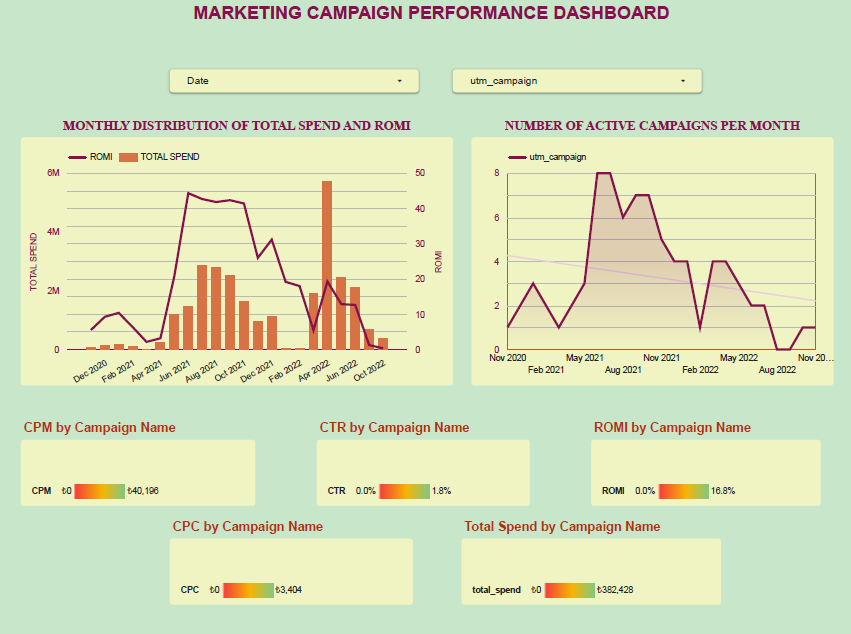

# Marketing Campaign Performance Analysis
This project analyzes marketing campaign performance using SQL.

## Dataset
Advertising data from Facebook Ads and Google Ads.

## Business Questions
- What is the total advertising spend?
- Which campaigns generate the most clicks?
- What is the CTR, CPC, CPM and ROMI for each campaign?

## Problem Statement
-A company runs advertising campaigns on Facebook and Google Ads.
-The goal of this analysis is to evaluate campaign performance by calculating key marketing metrics such as CTR, CPC, CPM and ROMI.
-The analysis helps identify which campaigns generate the best return on investment.

## SQL Techniques Used
- CTE
- UNION ALL
- Aggregations
- CASE statements
- URL parameter extraction

## Key Metrics
- CTR (Click Through Rate)
  = Clicks / Impressions
- CPC (Cost Per Click)
  = Spend / Clicks
- CPM (Cost Per Mille)
  = Spend / Impressions * 100
- ROMI (Return on Marketing Investment)
  = (Revenue - Spend) / Spend
  
## Dashboard
A marketing performance dashboard was created using Looker Studio 
to visualize campaign performance and key marketing metrics.
The dashboard includes:

- Monthly Total Spend and ROMI trends
- Number of active campaigns per month
- CPM by campaign
- CPC by campaign
- CTR by campaign
- ROMI by campaign
You can view the dashboard in the attached PDF file.

## Dashboard Preview

## Key Insights
- Some campaigns generated significantly higher ROMI despite lower spend.
- Campaign CTR varies between 0% and 1.8%, indicating differences in ad engagement.
- Marketing spend peaked in mid-2022 while ROMI fluctuated across months.
- Certain campaigns achieved higher efficiency with lower CPC.
